# Tasker - Architecture Documentation

A task management app built with Godot 4.6 (mobile-focused). Tracks daily tasks, focus sessions, and completion streaks.

## High-Level System Architecture

```mermaid
graph TB
    subgraph "Godot 4.6 Engine"
        SceneTree["Scene Tree"]
        InputSystem["Input System"]
        FileSystem["File System"]
        ThemeSystem["Theme System"]
    end

    subgraph "Core Runtime"
        RTV["🔹 RTV Autoload<br/>Global State Manager<br/>rtv.gd"]
        RTV -->|Contains| GlobalState["Global Variables<br/>• Task Data Dicts<br/>• User Settings<br/>• Focus Sessions<br/>• Streak Data<br/>• UI State"]
    end

    subgraph "Data Layer"
        Saving["Saving Script<br/>Handles I/O<br/>Saving.gd"]
        TaskDataJSON["user://taskdata.json<br/>Tasks, Colors, Icons<br/>Streaks, Completion"]
        LastLogJSON["user://lastlog.json<br/>Last Access Date<br/>Streak Tracking"]
        BgImage["user://bg.jpg<br/>User Background"]
        
        Saving -->|Read/Write| TaskDataJSON
        Saving -->|Read/Write| LastLogJSON
        Saving -->|Load| BgImage
    end

    subgraph "Main Scene - main.tscn"
        Background["Background TextureRect<br/>Saving Script Attached"]
        MainUI["Control Node<br/>RTV Script Attached"]
        Greeting["Greeting Module<br/>Time Display"]
        TabHandler["TabHandler ScrollContainer<br/>Scroll Positions Mgmt"]
        PopUpInstantiator["PopUp Instantiator<br/>Dynamic Dialogs"]
        Warnings["Warnings Label<br/>Error Messages"]
    end

    subgraph "UI Tabs - Managed by TabHandler"
        DailyUI["📋 Daily UI Tab<br/>Current Tasks"]
        OverviewUI["📊 Overview Tab<br/>Task Statistics"]
        FocusUI["🎯 Focus Tab<br/>Focus Sessions"]
        SettingsUI["⚙️ Settings Tab<br/>User Config"]
    end

    subgraph "Daily UI Components - Daily UI.tscn"
        DailyHandler["Daily Handler"]
        DailyTaskScene["Daily Task Scene<br/>Task Instance<br/>Daily Task.gd"]
        DailyDoneScene["Daily Task Done<br/>Completed Tasks"]
    end

    subgraph "Overview Tab - Overview.tscn"
        OverviewScript["Overview.gd<br/>Task Statistics"]
        ProgressBar["Progress Bar<br/>Score Display"]
        TaskLists["Active List<br/>Completed List"]
    end

    subgraph "Focus Tab - FocusUI.tscn"
        FocusHandler["FocusHandler.gd<br/>Session Manager"]
        SessionInstantiator["SessionInstantiator<br/>Dynamic Sessions"]
        FocusSession["FocusSession.gd<br/>Timer & Data"]
    end

    subgraph "Creation Flow - New Task.tscn"
        NewTaskScript["New Task.gd<br/>Create UI"]
        EditScript["Edit.gd<br/>Edit Existing"]
    end

    subgraph "Settings - Settings.tscn"
        SettingsScript["Settings.gd<br/>Config Manager"]
        ColorPicker["Color & Theme"]
        UpdateCheck["Update Module"]
    end

    subgraph "One-Time Modals"
        Orientation["Orientation.tscn<br/>First Launch Setup"]
        UpdateNotice["Update.tscn<br/>Update Prompt"]
        PopUp["Pop Up.tscn<br/>General Dialogs"]
    end

    subgraph "Sidebar Navigation - sidebar.tscn"
        SidebarScript["Sidebar.gd<br/>Tab Selection"]
        SelectionIndicator["Selection Indicator<br/>Visual Feedback"]
    end

    subgraph "Theme & Styling"
        MainTheme["Main Theme.tres<br/>Colors, Fonts"]
        ScrollProfiles["Scroll Profiles<br/>Smooth/Standard"]
        TextureResources["Textures<br/>Icons, Colors"]
    end

    subgraph "Addons"
        SmoothScroll["🔌 SmoothScroll<br/>Smooth ScrollContainer"]
        SVGTexture["🔌 SVG Texture 2D<br/>SVG Support"]
    end

    subgraph "Tools & Utilities"
        TimeScript["Time.gd<br/>Time Tracking"]
        DragZone["DragZone.gd<br/>Drag Interactions"]
        Confetti["fake_confetti_particles.gd<br/>Visual Effects"]
    end

    %% Connections
    RTV -->|Manages State| DailyUI
    RTV -->|Manages State| OverviewUI
    RTV -->|Manages State| FocusUI
    RTV -->|Manages State| SettingsUI
    
    MainUI -->|Contains| TabHandler
    MainUI -->|Contains| Greeting
    MainUI -->|Contains| PopUpInstantiator
    MainUI -->|Contains| Warnings
    MainUI -->|Contains| SidebarScript
    
    TabHandler -->|Switches Between| DailyUI
    TabHandler -->|Switches Between| OverviewUI
    TabHandler -->|Switches Between| FocusUI
    TabHandler -->|Switches Between| SettingsUI
    
    DailyUI -->|Instantiates| DailyTaskScene
    DailyUI -->|Shows Done Tasks| DailyDoneScene
    DailyTaskScene -->|Read/Update| RTV
    
    OverviewUI -->|Reads| RTV
    OverviewScript -->|Updates| ProgressBar
    
    FocusUI -->|Manages| SessionInstantiator
    FocusHandler -->|Creates/Tracks| FocusSession
    FocusSession -->|Updates| RTV
    
    SidebarScript -->|Triggers| TabHandler
    SidebarScript -->|Reads State| RTV
    
    NewTaskScript -->|Creates Task| RTV
    EditScript -->|Modifies Task| RTV
    
    SettingsScript -->|Updates| RTV
    UpdateCheck -->|Checks Version| RTV
    
    Orientation -->|First Setup| RTV
    PopUpInstantiator -->|Shows| PopUp
    
    Saving -->|Reads| RTV
    Saving -->|Writes| RTV
    
    MainTheme -->|Styles| MainUI
    ScrollProfiles -->|Config| SmoothScroll
    TextureResources -->|Used By| DailyUI
    TextureResources -->|Used By| NewTaskScript
    
    TimeScript -->|Updates| Greeting
    FocusHandler -->|Uses| TimeScript
    
    SmoothScroll -->|Enhances| TabHandler
    SmoothScroll -->|Enhances| OverviewUI
    SVGTexture -->|Renders| TextureResources

    style RTV fill:#ff9999
    style Saving fill:#99ccff
    style GlobalState fill:#99ff99
    style TaskDataJSON fill:#ffcc99
    style LastLogJSON fill:#ffcc99
```



---

## Data Architecture

The app uses a **centralized state pattern** via the RTV autoload, with JSON-based persistence.

### RTV Global State (rtv.gd)

Core dictionary-based state management. All task data lives in these dictionaries:

- **Task Storage:**
  - `namedic`: Task ID → Task Name
  - `iddic`: Task Name → Task ID (reverse lookup)
  - `colordic`: Task ID → Color Index (0-5)
  - `icondic`: Task ID → Icon Index (1-6)
  - `donedic`: Task ID → Completion Status (boolean)

- **Streak Tracking:**
  - `streakdic`: Task ID → Streak Count
  - `comlastlogdic`: Task ID → Completed Today (boolean)
  - `lastlogd`: Last access date (string)
  - `streakstatus`: Streak health ("hold", "same", "kill")

- **Focus Sessions:**
  - `sessionid`: Array of session identifiers
  - `sessiontime`: Session ID → Duration in minutes
  - `sessionlen`: Session ID → Session length
  - `sessiondate`: Session ID → Session date

- **UI State & Settings:**
  - `iscreating`: New task modal active
  - `isediting`: Edit task modal active
  - `issetting`: Settings modal active
  - `settings`: User preferences (theme, username, goals, etc.)

### Data Persistence

**Two JSON files in user:// directory:**

1. **taskdata.json** - Saved automatically by Saving.gd timer
   - Contains all task dictionaries
   - Stores lastgivenid (auto-increment counter)
   - Loaded on application start

2. **lastlog.json** - Tracks access dates for streak system
   - Stores lastlogd (last access date)
   - Determines streak status transitions
   - Used to reset daily flags

---

## Module Breakdown

### Main Entry Point (Main/main.tscn)

Root scene with several key components:

- **RTV Autoload**: Automatically instantiated at engine startup
- **Saving.gd**: Attached to Background TextureRect
  - Handles all file I/O
  - Auto-saves every ~30 seconds
  - Loads data on startup
- **TabHandler.gd**: Manages tab switching with smooth scroll animations
- **Greeting.gd**: Displays date/time and version info
- **Sidebar.gd**: Navigation between Daily/Overview/Focus/Settings
- **PopUp Instantiator**: Factory for dynamic dialog/notification creation

### Daily UI Tab (Daily UI/)

Displays active and completed tasks for the current day.

- **Daily Task.gd**: Individual task instance
  - Renders task color, icon, name
  - Handles "Done" and "Edit" button clicks
  - Updates RTV dictionaries on completion
  - Manages streak visual display (flame icon)
- **Daily Task Done.gd**: Completed task variant
  - Shows archive list
  - Allows restoration

### Overview Tab (Overview/)

Statistics and progress tracking.

- **Overview.gd**: Aggregates task data
  - Calculates completion percentages
  - Updates progress bars/scores
  - Two columns: Active tasks, Completed tasks
- Reads directly from RTV dictionaries (no mutations)

### Focus Tab (FocusUI/)

Pomodoro-style focus sessions.

- **FocusHandler.gd**: Session management
  - Displays focus goals (daily/weekly minutes)
  - Handles start/pause/end session flow
- **FocusSession.gd**: Individual session tracking
  - Timer loop (runs every frame)
  - Accumulates focusdatamin and focusdatascore
  - Displays real-time counter
- **SessionInstantiator.gd**: Creates session instances dynamically

### New Task Modal (New Task/)

Task creation and editing.

- **New Task.gd**: Creation UI
  - Color/icon picker
  - Task name input
  - Instantiates task into RTV on "Create"
- **Edit.gd**: Modification UI
  - Pre-fills existing task data
  - Updates all relevant dictionaries on save

### Settings (Settings/)

User configuration and app info.

- **Settings.gd**: Manages user preferences
  - Time format (12/24 hour)
  - Username
  - Accent color selection
  - Notification preferences
  - Focus session goals
- **Update.gd**: Version check and update notifications

---

## Scene Hierarchy

```
main.tscn (Control)
├── Background (TextureRect) [Saving.gd]
├── Control (rtv.gd)
│   ├── Greeting (Control)
│   ├── Sidebar (sidebar.tscn)
│   │   └── Tab buttons + Selection indicator
│   ├── TabHandler (ScrollContainer)
│   │   ├── Daily UI (Daily UI.tscn)
│   │   │   ├── Daily Task instances (instantiated)
│   │   │   └── Daily Task Done instances
│   │   ├── Overview (Overview.tscn)
│   │   ├── Focus (FocusUI.tscn)
│   │   │   ├── Focus session controls
│   │   │   └── Session instances (instantiated)
│   │   └── New Task (New Task.tscn)
│   ├── Settings (Settings.tscn)
│   ├── Orientation (Orientation.tscn) [shown once]
│   ├── Pop Up (Pop Up.tscn)
│   ├── Update (Update.tscn)
│   └── Warnings (Label)
└── Textures & Assets
```

---

## Key Design Patterns

### 1. **Global State via Autoload (RTV)**
All UI components read/write to RTV dictionaries. No direct scene-to-scene communication.

### 2. **Visibility-Based Tab Switching**
TabHandler uses a ScrollContainer with `scroll_vertical` tweens. UI tabs remain in tree but scroll in/out of view.

### 3. **Instant Dictionary Storage**
All mutations directly update RTV dictionaries. Saving.gd serializes to JSON periodically.

### 4. **Color/Icon Pointer Maps**
Abstract indexes (0-5 for colors, 1-6 for icons) map to texture file paths. Keeps data minimal.

### 5. **Signal-Driven UI Updates**
Key modules emit signals (e.g., `changed_tab`, `_settings_changes`) to trigger re-renders.

---

## Directory Structure

```
Tasker/
├── Main/
│   ├── main.tscn (root scene)
│   ├── Scipts/ (note: typo in folder name)
│   │   ├── rtv.gd (global state)
│   │   ├── Saving.gd (persistence)
│   │   ├── TabHandler.gd
│   │   ├── Greeting.gd
│   │   ├── Warnings.gd
│   │   ├── Pop Up Instantiator.gd
│   │   └── DragZone.gd
│   ├── Time/ (time tracking utilities)
│   ├── Textures/ (gradients, backgrounds)
│   └── Tags/ (version tags: Beta.tscn, IB.tscn)
│
├── Daily UI / (active tasks display)
│   ├── Daily UI.tscn
│   └── Textures/ (colors, icons)
│
├── Daily Task/ (individual task display)
│   ├── Scripts/
│   │   ├── Daily Task.gd
│   │   └── Daily Task Done.gd
│   └── Textures/ (colors, icons)
│
├── Overview/ (statistics & progress)
│   ├── Scripts/
│   │   └── Overview.gd
│   └── Task/ (task stat display)
│
├── FocusUI/ (focus sessions)
│   ├── Scripts/
│   │   ├── FocusHandler.gd
│   │   └── SessionInstantiator.gd
│   ├── Session/
│   │   └── FocusSession.gd
│   └── Textures/
│
├── New Task/ (creation/editing)
│   ├── Scripts/
│   │   └── New Task.gd
│   ├── Edit/
│   │   └── Scripts/Edit.gd
│   └── Textures/ (colors, containers)
│
├── Settings/
│   ├── Scripts/
│   │   ├── Settings.gd
│   │   ├── Update.gd
│   │   └── ColorPicker.gd
│   └── Textures/
│
├── Sidebar/ (navigation)
│   ├── Scripts/
│   │   ├── Sidebar.gd
│   │   ├── Daily.gd (tab handler)
│   │   ├── Overview.gd (tab handler)
│   │   └── Focus.gd (tab handler)
│   └── Textures/
│
├── Orientation/ (first-launch setup)
│   └── Scripts/Orientation.gd
│
├── Pop Up/ (generic dialogs)
│   └── Scripts/Pop Up.gd
│
├── Update/ (update notifications)
│   └── Scripts/Update.gd
│
├── Console/ (debug console)
│   └── Console.tscn
│
├── Theme/
│   ├── Main Theme.tres (colors, fonts)
│   ├── Fonts/
│   └── ...
│
├── Scroll Profiles/ (smooth scroll settings)
│   ├── Smooth.tres
│   └── Standard.tres
│
├── Tools/ (utilities)
│   └── fake_confetti_particles.gd
│
├── addons/
│   ├── SmoothScroll/ (custom scroll addon)
│   └── merovi.svgtexture2d/ (SVG rendering)
│
├── project.godot (engine config)
├── export_presets.cfg (build settings)
└── README.md
```

---

## Startup Flow

```
Engine loads project.godot
    ↓
Autoload: RTV created, defaults initialized
    ↓
Main scene (main.tscn) loads
    ↓
Saving.gd _ready():
    - Check if user://taskdata.json exists
    - If yes: loadtaskdata() → populate RTV dicts
    - If no: skip (first run, RTV has defaults)
    ↓
Check lastlog.json for streak state
    - Determine streakstatus ("hold"/"same"/"kill")
    - Process comlastlogdic resets if needed
    ↓
Load background image if exists (user://bg.jpg)
    ↓
Start auto-save timer (periodic writes to JSON)
    ↓
Check for app updates
    ↓
Show Orientation scene if first run
    ↓
App ready for user interaction
```

---

## Important Notes

### Color & Icon Systems

Colors are mapped by index (0-5):
- 0: Blue, 1: Green, 2: Orange, 3: Pink, 4: Red, 5: Teal

Icons are mapped by index (1-6):
- 1: Dumbbell, 2: Book, 3: Paw, 4: Paintbrush, 5: Mindful, 6: Dollar

### Streak Logic

- **"hold"**: Previous day's task was NOT completed → can obtain streak today
- **"same"**: Previous day's task WAS completed → can obtain streak (chain continues)
- **"kill"**: More than 1 day since last access → all streaks reset to 0

### Focus Session Data

Separate from tasks. Stores:
- `sessionid`: Unique identifier per session
- `sessiontime`: Duration in minutes
- `focusdatamin`: Cumulative minutes this runtime
- `focusdatascore`: Cumulative score this runtime

Useful for weekly/monthly focus goals.

### Mobile-First Design

- Target resolution: 2304x1296 (iPad landscape)
- Canvas stretch mode: "canvas_items" → scales UI
- Rendering: Mobile (GLES3, lower resource usage)
- Max FPS: 144

---

## Common Development Tasks

### Adding a New Task Property

1. Add field to `rtv.gd` (new dictionary)
2. Initialize in `rtv.gd` defaults
3. Load/save in `Saving.gd` (loadtaskdata/savetaskdata)
4. Add setter in `New Task.gd` when creating
5. Update `Daily Task.gd` to display/use it

### Modifying Tab UI

1. Update scene files in main.tscn
2. Adjust scroll positions in `TabHandler.gd` `positions` dict
3. Add input binding in `project.godot` if new key
4. Update `Sidebar.gd` button handlers

### Changing Persistence Format

All I/O goes through `Saving.gd`. Modify:
- `savetaskdata()`: How data is serialized
- `loadtaskdata()`: How data is deserialized
- `savelastlog()` / `loadlastlog()`: Streak system

### Adding Settings

1. Add to `rtv.settings` dict with default value
2. Add UI in Settings.tscn
3. Bind UI to `Settings.gd` updater
4. Ensure saved in `savelastlog()` (persists as file)
